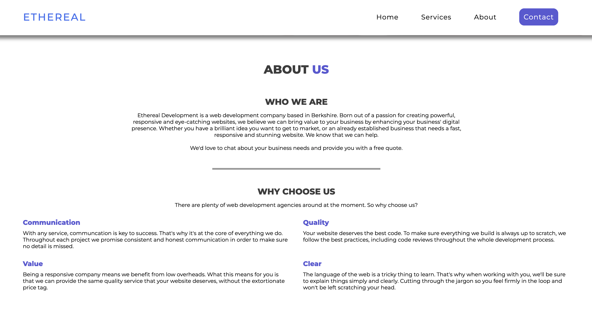
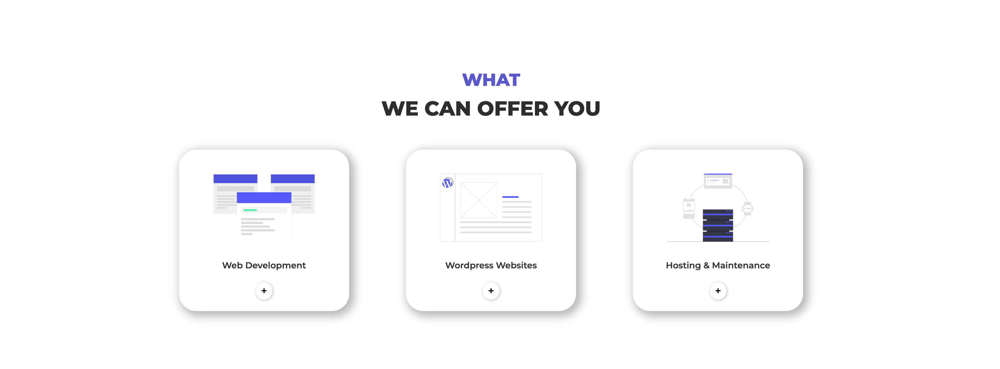
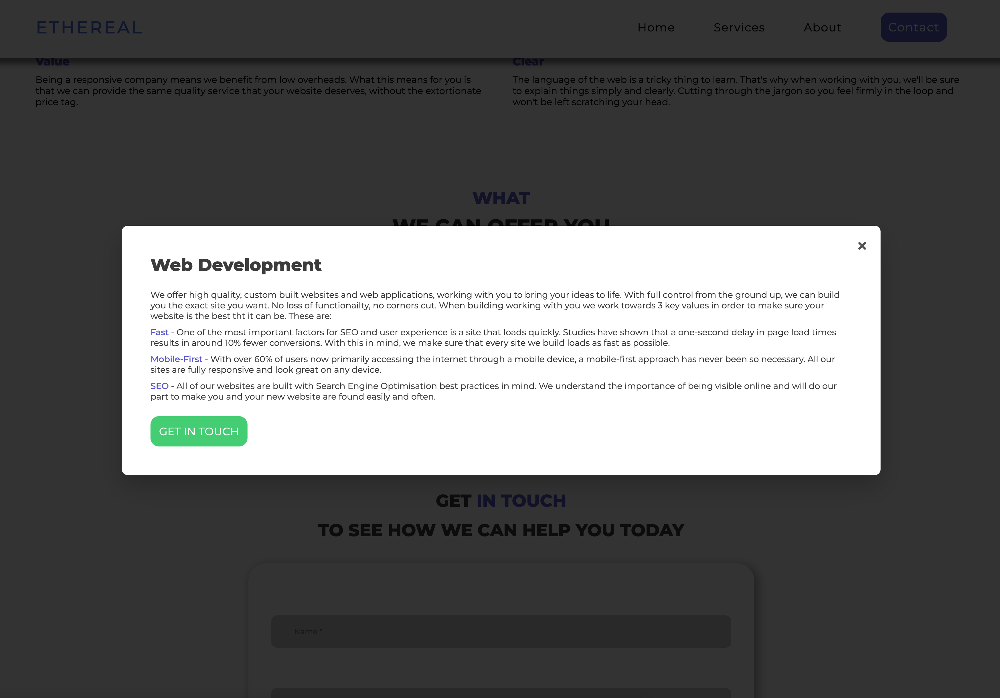
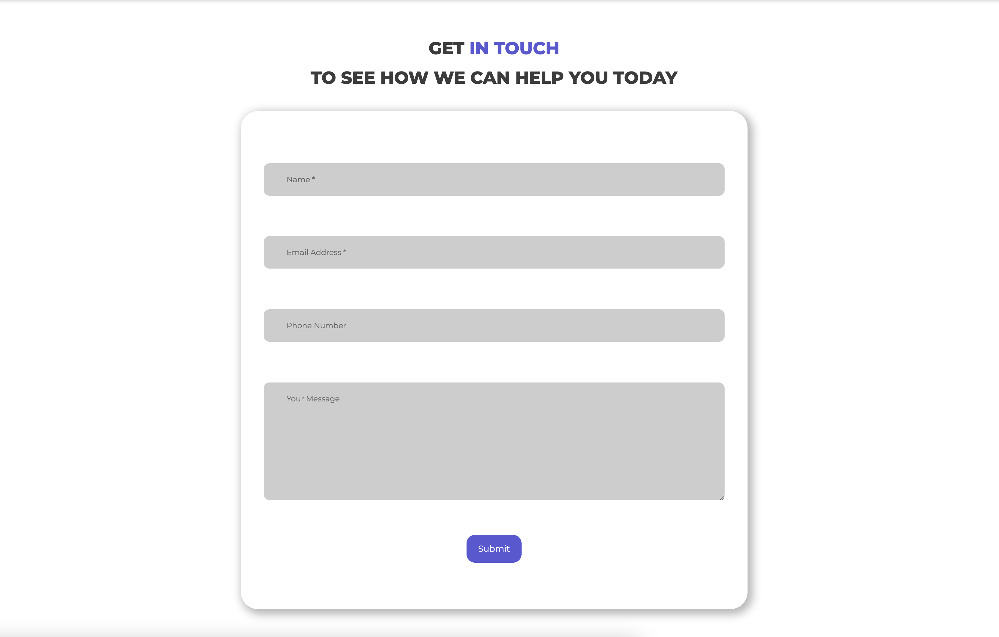

# Ethereal Devlopment Website

 

A fully-responsive freelancing website I created during Lockdown. Responsive nav, JS Typewriter effect and working PHP contact form.

 

#### Built using:

<ul>
    <li>HTML & SCSS</li>
    <li>Vanilla JS</li>
    <li>PHP</li>
</ul>

 

## Homepage

Functionality includes sticky nav that vanishes when at the top of the screen and a typewriter effect in the title text that cycles the words 'Mobile First', 'Fully Responsive', 'Search Engine Friendly' and 'Professional' 

 

## About Us

 

## Services

 

## PHP Contact Us Form

Due to limitations with JS I built the Contact Us form with PHP to allow a seamless user experience. Allowing the user to send an email direct from the website without having to be redirected to their email app.

 

## Footer

